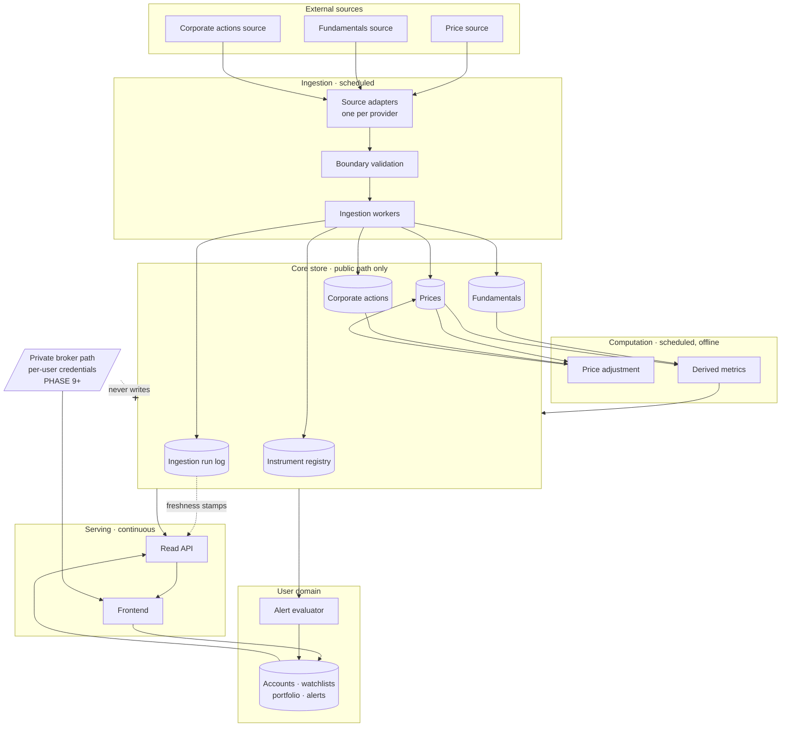

# Phase 2 — System Architecture

Status: **draft, awaiting sign-off**
Last updated: 2026-09-11
Depends on: [01-vision-and-scope.md](01-vision-and-scope.md)

This document describes components, boundaries and failure modes. It
deliberately names **no technologies**. Which language, framework, database or
host we use is Phase 3, and the architecture should survive being told the
answer. If a decision here only makes sense given a particular framework, it
is in the wrong document.

---

## 1. Shape of the system

Three things run on different clocks, and that is the main structural fact:

- **Ingestion** runs on a schedule, mostly once a day after market close. It
  is slow, it talks to the outside world, and it fails regularly.
- **Computation** runs after ingestion. It is deterministic and repeatable and
  touches no network.
- **Serving** runs continuously, must be fast, and must never depend on an
  external API being up.

Keeping these separate is what makes the platform survivable on free
infrastructure. A visitor loading a company page must never trigger a fetch
from a data provider. If they could, one popular link would exhaust a rate
limit and take the site down.

The dashed crossed line is the most important edge in the diagram. It is the
Section 6 constraint from Phase 1 drawn as a rule the code must enforce.

## 2. Components

### 2.1 Instrument registry

The universe of tradeable instruments and the identity everything else hangs
off.

**Everything internal references an opaque instrument id, never a ticker
string.** Tickers on Indian exchanges get changed on renames and can be reused
by a different company later. A price series keyed on the string `"XYZ"` will
silently splice two unrelated companies together the day that happens, and
nothing will look wrong. The registry keeps the mapping from ticker-plus-
exchange-plus-date-range to a stable internal id, and records renames rather
than overwriting them.

Per decision 8.1, an instrument carries its exchange and currency as fields.
There is no global "the exchange" and no assumption of rupees in any
calculation.

### 2.2 Source adapters

One adapter per external provider, all behind a single interface. An adapter's
only job is to turn "that provider's response" into "our domain objects, or a
rejection".

This exists so that a provider changing its response shape breaks exactly one
file. It is the same lesson as `paper-trader`'s `DataSource`, arrived at the
same way — but a separate implementation in a separate repository, because
these are separate projects and the coupling would not be worth it.

Each adapter also carries its **licence metadata**: what the source permits,
whether we may redistribute, what the rate limit is. Phase 5 fills this in per
source, in writing. An adapter without verified licence metadata does not get
wired into a worker.

### 2.3 Boundary validation

Nothing enters the core store without passing validation at the point of
entry. A bar where high is below low, a close outside the day's range, a
negative volume, a revenue figure that is null — all rejected here.

**Bad rows are rejected and recorded, never imputed.** Inventing a price to
fill a hole is worse than having a hole, because the hole is visible and the
invention is not.

### 2.4 Ingestion workers

Scheduled jobs, one per data kind: prices, fundamentals, corporate actions.
Each follows the same shape — decide the window, fetch through the adapter,
validate, upsert, record the run.

**All writes are idempotent on a natural key.** Re-running yesterday's price
ingestion must leave the store exactly as one run would. This is the property
that makes retrying safe, and retrying is the normal case rather than the
exception when the other end is a free API.

Fundamentals are the awkward one. They do not arrive daily, they arrive when a
company files, and they get restated afterwards. The fundamentals worker is
therefore **event-shaped rather than window-shaped**: it looks for statements
it has not seen, and a restatement is a new version of a period rather than an
overwrite of it. Phase 4 has to model a financial period as something that can
have more than one reported version.

### 2.5 Ingestion run log

Every attempt writes a row: source, kind, window, rows written, rows rejected,
outcome, duration.

This is a small component doing three jobs at once. It is how a failure
becomes visible instead of silent. It is where the "last updated" stamps in
the UI come from. And it is what Phase 10 monitors, so monitoring does not
have to be bolted on later.

The rule that makes it work: **a failed run is a row, not an absence.** If
nothing is written when a run fails, then a scheduler that never fired and a
run that failed look identical, and the free-tier scheduler not firing is a
real and likely failure.

### 2.6 Price adjustment

Corporate actions change the meaning of historical prices. A 1:5 split makes
yesterday's ₹1000 close and today's ₹200 close look like a 80% crash unless
the history is adjusted.

Adjustment is kept as a **separate computation step over stored raw prices**,
not folded into ingestion. Two reasons. Corporate actions are often learned
about after the fact, so the adjustment has to be re-runnable over history.
And keeping raw prices means an adjustment bug is recoverable rather than
destructive — we recompute instead of re-ingesting everything.

### 2.7 Derived metrics

Ratios and growth figures computed from stored fundamentals and prices.

**Materialised, not computed on read.** Screening means filtering the whole
NSE universe on several metrics at once, and computing those per request would
be both slow and wasteful given the inputs change once a day.

Materialising creates the risk that the platform shows a number nobody can
explain, which would break the central promise from Phase 1 §2. So every
stored metric carries **the identity of the inputs it was computed from, the
reporting period they belong to, and when it was computed**. A metric that
cannot name its inputs is a bug, not a display problem.

### 2.8 Read API

The only thing the frontend talks to. Serves three query shapes: one
instrument over time, many instruments filtered on metrics, and reference data.

It reads from the core store and never from an external provider. The
freshness stamps it returns come from the ingestion run log, so the UI can
always tell the user how current the data is — including when the answer is
"this is four days stale because ingestion has been failing".

### 2.9 User domain

Accounts, watchlists, portfolio entries, alert definitions.

Logically separate from market data, with no foreign keys from market data
into it. Market data is a shared public asset; user data is private and
per-tenant, has different access rules, different backup needs, and different
deletion obligations. Whether they share a physical database in v1 is a Phase
3 question, but the boundary is decided here: **market data never depends on
user data.**

Portfolio entries are bookkeeping the user types in. No broker, no custody, no
KYC, per Phase 1 §3.

### 2.10 Alert evaluator

Scheduled, runs after ingestion and metric computation. Evaluates alert
conditions against fresh data and dispatches notifications.

It runs after, not during, so a slow or failing notification channel cannot
stall ingestion.

### 2.11 Private broker path — fenced now, built later

Not in v1. Specified here because the fence has to exist in the architecture
before anyone is tempted to cross it.

If a user connects their own broker account, that data is fetched with their
credentials, served only to them, and **never written to the core store**. The
enforcement is structural rather than a code review convention: the private
path gets no write handle to the core store at all.

## 3. Invariants

The rules that keep the system honest. Any one of these being violated is a
defect regardless of whether anything looks wrong.

1. Nothing outside a source adapter talks to an external provider.
2. Nothing enters the core store without passing boundary validation.
3. Every ingestion write is idempotent on a natural key.
4. Every ingestion attempt produces a run-log row, success or failure.
5. Raw prices are never overwritten by adjusted prices.
6. Every stored derived value names its inputs and its computation time.
7. Private-path data never writes to the core store.
8. Market data never reads from the user domain.
9. No serving path triggers an external fetch.

## 4. Failure modes

Designing for these now is cheaper than discovering them on a free tier at
3am.

| Failure | What happens today if unhandled | Design response |
|---|---|---|
| Source down or rate limited | Ingestion silently does nothing | Run logged as failed; last-good data still served with an honest staleness stamp |
| Source returns malformed data | Garbage propagates into every metric | Rejected at the boundary; rejection counted in the run log |
| Source changes its response shape | Fields silently become null | Adapter validates shape and fails loudly rather than coercing |
| Partial ingestion, then a crash | Duplicate or double-counted rows on retry | Idempotent upserts on natural keys make retry a no-op |
| **Corporate action missed** | Price history silently wrong forever | Detect unexplained close-to-open discontinuities and flag for review; adjustment is re-runnable over history |
| Statement restated by the company | Metrics quietly disagree with the filing | Periods hold versioned reports; metrics name the version they used |
| Scheduler never fires | Looks identical to "nothing to do" | Expected-run gap detection over the run log |
| Free-tier database sleeps | First visitor after idle sees an error | Serving path tolerates cold start; treated as latency, not failure |
| Metric computed from stale inputs | A confident, wrong number on screen | Metrics carry input period and computation time; UI surfaces both |
| Notification channel failing | Ingestion stalls behind it | Alert evaluation is downstream of and asynchronous to ingestion |

## 5. What this architecture does not yet answer

Honest list of things deliberately left to later phases:

- **Which technologies.** Phase 3.
- **Exact schema.** Phase 4, though §2.1, §2.4 and §2.7 constrain it: stable
  instrument ids, versioned reporting periods, metrics carrying provenance.
- **Which sources, and whether their terms permit any of this.** Phase 5. If a
  source turns out to be unusable, components survive and adapters change.
- **How the universe is discovered.** Populating the instrument registry for
  all of NSE is itself an ingestion problem, and Phase 5 needs to find a
  source for the listing itself, not only for prices.
- **Backfill.** The first run has to load years of history under a rate limit,
  which is a different problem from the daily incremental run. Phase 6.

---

## Exit criteria for Phase 2

- [ ] Component boundaries agreed
- [ ] Invariants in §3 agreed — these become review rules
- [ ] Failure modes in §4 accepted as the set we design for
- [ ] Every v1 feature from Phase 1 §5 has a home in §2
- [ ] Phase 3 may then begin
